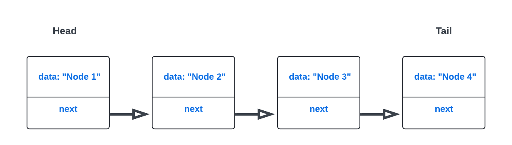

# Struktury danych

Struktury danych używane w projekcie to:

1. Lista jednokierunkowa reprezentowana przez strukturę `TList`:

    ```C
    struct TList {
		struct Node* head;
		struct Node* tail;
		int numElem;
		int maxSize;
		pthread_mutex_t listMutex;
		pthread_cond_t notFull;      
		pthread_cond_t notEmpty;
		int isDestroyed;
		};
    ```
	`struct Node* head` - wskaźnik na początek listy  
	`struct Node* tail` - wskaźnik na koniec listy  
	`int numElem` - liczba elementów znajdujących się obecnie na liście  
	`int maxSize` - maksymalny rozmiar listy  
	`pthread_mutex_t listMutex` - mutex do synchronizacji dostepu do danej listy  
	`pthread_cond_t notFull` - zmienna warunkowa, sygnalizuje że lista nie jest pełna  
	`pthread_cond_t notEmpty` - zmienna warunkowa, sygnalizuje że lista zawiera jakieś dane  
	`int isDestroyed` - flaga mówiąca czy lista jest aktywna
  

1. Węzeł listy (element listy) reprezentowany przez strukturę `Node`:

    ```C
    struct Node {
		void* data;
		struct Node* next;
    };
    ```
	`void* data` - wskaźnik na przechowywane przez węzeł dane  
	`struct Node* next` - wskaźnik na nastepny element w liście  
	
# Funkcje

Implementacja zawiera jedynie funkcje opisane w specyfikacji zadania, które wykonują wszytskie wymagane operacje.


# Algorytm 

Lista w mojej implementacji, jak wyżej wspomniane, jest strukturą reprezentującą listę wskaźników `Linked list` przechowująca łańcuchy tekstowe.
Przechowuje ona wskaźnik na początek listy, czyli jej głowę `head` oraz koniec, czyli ogon `tail`. Poniższy rysunek przedstawia srukturę przykładowej
niepustej listy:

  


* zachowanie w przypadku pustej listy dla funcji blokującej getItem():
  ```C
  struct TList {
    head = NULL;          // brak pierwszego elementu
    tail = NULL;          // brak ostatniego elementu
    numElem = 0;          // liczba elementów = 0
    maxSize = N;          // maksymalny rozmiar = N
    listMutex = ...       // zainicjalizowany mutex
    notFull = ...         // zainicjalizowana zmienna warunkowa
    notEmpty = ...        // zainicjalizowana zmienna warunkowa
  };
  ```
Po stworzeniu pustej listy i wywołaniu dwóch wątków próbujących pobrac element z listy, wątek oczekuje aż lista nie będzie pusta. Wywołując odpowiednio dwa wątki dodające elementy do listy, program kończy się z powodzeniem. W takiej sekwencji (na początku wywołania `getItem()` a następnie `putItem()`) ilość wątków usuwających musi być równa ilośći wątków dodających. W innym przypadku program sie nie skończy.

```C
// getThreadFunction - funkcja wywołująca funkcję getItem()
// putThreadFunction - funkcja wywołująca funkcje putItem()

TList* list1 = createList(0);   //utworzenie pustej listy
pthread_t thread4, thread5, thread6, thread7;

printf("Lista utworzona, początkowa liczba elementów: %d\n", getCount(list1));
printf("Uruchomienie dwóch wątków pobierających.\n");
pthread_create(&thread4, NULL, getThreadFunction, list1);
pthread_create(&thread5, NULL, getThreadFunction, list1);

sleep(2);

printf("Dodanie elementu do listy w innym wątku.\n");
pthread_create(&thread6, NULL, putThreadFunction, list1);
pthread_create(&thread7, NULL, putThreadFunction, list1);

```
# Przykład użycia

Test pokazujący działanie programu gdy dokona się zmniejszenia `maxSize` listy oraz próby dodania elementów już wtedy wykraczających poza zakres. Na początku tworzona jest lista o 3 elementach i `maxSize = 3`, następnie następuje zmiana `maxSize` na 2 oraz próba dodania jednego elementu. Program kończy się dopiero po usunięciu 2 elementów (`numElem = 1`, można więc dodać element).

```
Wątek dodający: dodano element 'data' 
Wątek dodający: dodano element 'data'
Wątek dodający: dodano element 'data'
Lista po dodaniu 3 elementów: 
data
data
data
Zmniejszenie maksymalnego rozmiaru listy do 2.
Próba dodania elemntu po zmniejszeniu maksymalnej wielkości - blokada.
Oczekiwanie na usunięcie dwóch elementów...
Wątek usuwający: próba usunięcia, wynik: 1
Wątek usuwający: próba usunięcia, wynik: 1
Wątek dodający: dodano element 'data'
Stan końcowy listy:
data
data
```